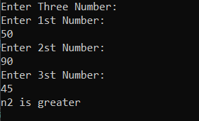

# Largest-of-three-numbers
## Aim:
To write a C# program to find the largest of three numbers

## Algorithm:
### Step1: 
Start
### Step2:
Create a class and declare three variable with integer datatype
### Step3:
Use if condition to check whether num1 is largest than num2 and num3
### Step4:
Use elif condition to check whether num2 is largest than num1 and num3
### Step5:
Use else condition to display that third variable is largest among all the variables
### Step6:
stop

## Program:
```
using System;
namespace Sharp
{
    internal class program
    {
        static void Main(string[] args)
        {
            Console.WriteLine("Enter Three Number: ");
            int n1, n2, n3;
            Console.WriteLine("Enter 1st Number: ");
            n1 = Convert.ToInt32(Console.ReadLine());
            Console.WriteLine("Enter 2st Number: ");
            n2 = Convert.ToInt32(Console.ReadLine());
            Console.WriteLine("Enter 3st Number: ");
            n3 = Convert.ToInt32(Console.ReadLine());

            if (n1 > n2 && n1 > n3)
            {
                Console.WriteLine("n1 is greater");
            }
            else if (n2 > n1 && n2 > n3)
            {
                Console.WriteLine("n2 is greater");
            }
            else
            {
                Console.WriteLine("n3 is greater");
            }
        }
    }
}

```
## Output:

## Result:
Thus the C# program to find the largest of three numbers is executed successfully
